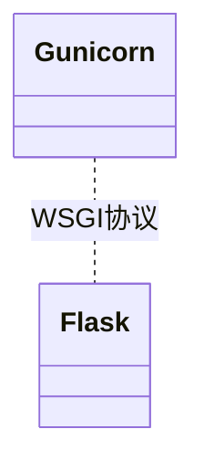
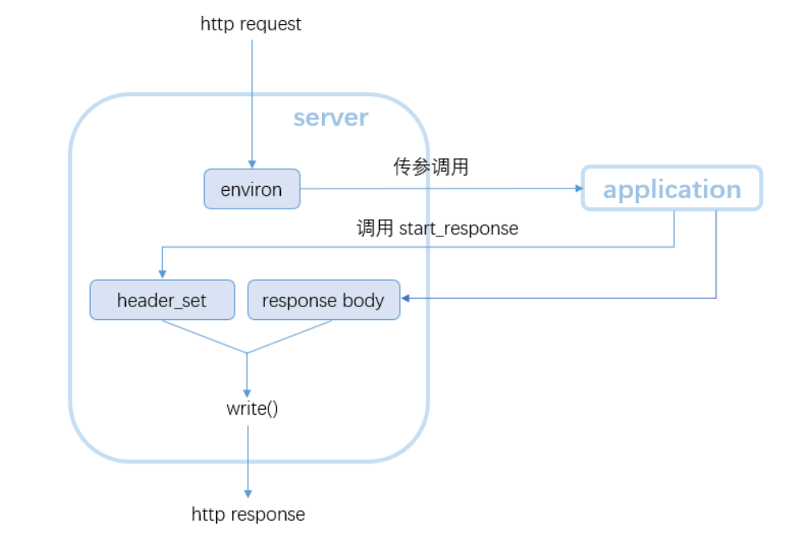

## WSGI

WSGI即Python Web Server Gateway Interface不是一个库，也不是一个服务器程序，他只是一个协议，或者说是一份标准，用来描述Server与Framework之间的通信接口。这样，一些符合WSGI标准的Framework如Flask、Django、web.py等等就可以与同样符合WSGI标准的Server库进行无缝对接。



* Server
  
server负责接受客户端请求并进行解析，然后将其传入application，客户端处理请求并将响应头和正文返回服务器。解析http请求时，生成一个environ字典并将其传递给可调用的application对象；另外，server还要实现一个start_response函数，其作用是生成响应头，start_response作为参数传入application中并被其调用
* Framework【WSGI Application】

应当是一个可调用的对象（实现了__call__ 函数的方法或者类），它接受两个参数：environ和start_response，其主要作用就是根据server传入的environ字典来生成一个“可迭代的”http报文并返回给server。

* 工作流程

  * 服务器创建socket，监听端口，等待客户端连接。
  * 当有请求来时，服务器解析客户端信息放到环境变量environ中，并调用绑定的handler来处理请求。
  * handler解析这个http请求，将请求信息例如method，path等放到environ中。
  * wsgi handler再将一些服务器端信息也放到environ中，最后服务器信息，客户端信息，本次请求信息全部都保存到了环境变量environ中。
  * wsgi handler 调用注册的wsgi app，并将environ和回调函数传给wsgi app
  * wsgi app 将reponse header/status/body 回传给wsgi handler
  * 最终handler还是通过socket将response信息塞回给客户端。



## WSGI接口说明

WSGI接口定义非常简单，它只要求Web开发者实现一个函数，就可以响应HTTP请求。
```
def application(environ, start_response):
    start_response('200 OK', [('Content-Type', 'text/html')])
    return '<h1>Hello, web!</h1>'
```
application()函数就是符合WSGI标准的一个HTTP处理函数，它接收两个参数：
```
environ：一个包含所有HTTP请求信息的dict对象；

start_response：一个发送HTTP响应的函数。
```
在application()函数中，调用：
```
start_response('200 OK', [('Content-Type', 'text/html')])
```
就发送了HTTP响应的Header，注意Header只能发送一次，也就是只能调用一次start_response()函数。start_response()函数接收两个参数，一个是HTTP响应码，一个是一组list表示的HTTP Header，每个Header用一个包含两个str的tuple表示。返回的返回值。然后，函数的返回值\<h1>Hello, web!\</h1>将作为HTTP响应的Body发送给浏览器。返回值不仅可以是字符串也可以是一个iterator对象。

## WSGI MiddleWare

wsgi基本处理模式为 ：  WSGI Server -> (WSGI Middleware)* -> WSGI Application。但其实这个中间件是可有可无的，中间件也要遵守WSGI协议，不同的是在对APP进行包装装饰，可以简单理解为这是一个装饰器。

## WSGI Server

系统已经实现了一个简单的WSGI Server，下面是代码实现

```
handler.run(self.server.get_app())

def run(self, application):
    try:
        self.setup_environ()
        ## 调用application
        self.result = application(self.environ, self.start_response)
        self.finish_response()
    except (ConnectionAbortedError, BrokenPipeError, ConnectionResetError):
        # We expect the client to close the connection abruptly from time
        # to time.
        return
    except:
        try:
            self.handle_error()
        except:
            # If we get an error handling an error, just give up already!
            self.close()
            raise   # ...and let the actual server figure it out.


def start_response(self, status, headers,exc_info=None):  
    """'start_response()' callable as specified by PEP 3333"""

    if exc_info:
        try:
            if self.headers_sent:
                # Re-raise original exception if headers sent
                raise exc_info[0](exc_info[1]).with_traceback(exc_info[2])
        finally:
            exc_info = None        # avoid dangling circular ref
    elif self.headers is not None:
        raise AssertionError("Headers already set!")
    ## 设置状态码和响应头
    self.status = status
    self.headers = self.headers_class(headers)
    status = self._convert_string_type(status, "Status")
    ## 合法性校验
    assert len(status)>=4,"Status must be at least 4 characters"
    assert status[:3].isdigit(), "Status message must begin w/3-digit code"
    assert status[3]==" ", "Status message must have a space after code"

    if __debug__:
        for name, val in headers:
            name = self._convert_string_type(name, "Header name")
            val = self._convert_string_type(val, "Header value")
            assert not is_hop_by_hop(name),\
                    f"Hop-by-hop header, '{name}: {val}', not allowed"

    return self.write

def finish_response(self):
    """Send any iterable data, then close self and the iterable

    Subclasses intended for use in asynchronous servers will
    want to redefine this method, such that it sets up callbacks
    in the event loop to iterate over the data, and to call
    'self.close()' once the response is finished.
    """
    try:
        if not self.result_is_file() or not self.sendfile():
            for data in self.result:
                self.write(data)
            self.finish_content()
    except:
        # Call close() on the iterable returned by the WSGI application
        # in case of an exception.
        if hasattr(self.result, 'close'):
            self.result.close()
        raise
    else:
        # will set status, result, headers, and environ fields to None.
        self.close()

def write(self, data):
    """'write()' callable as specified by PEP 3333"""

    assert type(data) is bytes, \
        "write() argument must be a bytes instance"

    if not self.status:
        raise AssertionError("write() before start_response()")

    elif not self.headers_sent:
        # Before the first output, send the stored headers
        self.bytes_sent = len(data)    # make sure we know content-length
        self.send_headers()
    else:
        self.bytes_sent += len(data)

    # XXX check Content-Length and truncate if too many bytes written?
    self._write(data)
    self._flush()

def send_headers(self):
    """Transmit headers to the client, via self._write()"""
    self.cleanup_headers()
    self.headers_sent = True
    if not self.origin_server or self.client_is_modern():
        self.send_preamble()
        self._write(bytes(self.headers))

def send_preamble(self):
    """Transmit version/status/date/server, via self._write()"""
    if self.origin_server:
        if self.client_is_modern():
            self._write(('HTTP/%s %s\r\n' % (self.http_version,self.status)).encode('iso-8859-1'))
            if 'Date' not in self.headers:
                self._write(
                    ('Date: %s\r\n' % format_date_time(time.time())).encode('iso-8859-1')
                )
            if self.server_software and 'Server' not in self.headers:
                self._write(('Server: %s\r\n' % self.server_software).encode('iso-8859-1'))
    else:
        self._write(('Status: %s\r\n' % self.status).encode('iso-8859-1'))
```

## References

* https://my.oschina.net/u/4885730/blog/4802144
* https://stackoverflow.com/questions/11926582/flask-wsgi-middleware-vs-before-and-after-request 
* https://segmentfault.com/a/1190000011365430